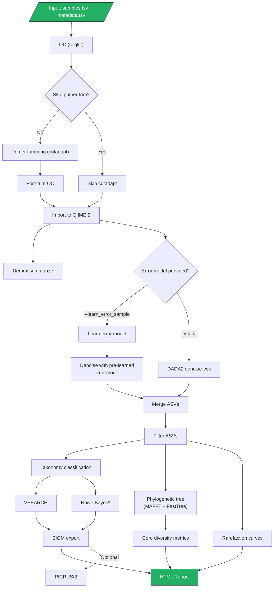

# HiFi-16S-workflow

A Nextflow DSL2 pipeline for processing PacBio HiFi full-length 16S amplicon data into high-quality ASVs using QIIME 2 and DADA2.

## Overview

This pipeline takes demultiplexed 16S amplicon FASTQ files and produces quality-filtered ASVs, taxonomy classifications, diversity metrics, and an interactive HTML report.

### Pipeline Steps

1. **Read QC** — Quality filtering with seqkit, optional downsampling
2. **Primer trimming** (optional) — Cutadapt removes V1-V9 primers and orients reads
3. **QIIME 2 import** — Reads imported as SampleData[SequencesWithQuality] artifacts
4. **DADA2 denoising** — Error learning and denoising via `denoise-ccs` with configurable error models (auto-detects Sequel II vs Revio/Kinnex)
5. **ASV filtering** — Remove low-abundance ASVs by total frequency and sample presence
6. **Taxonomy classification** — VSEARCH consensus classification (GTDB r220 default) and optional Naive Bayes multi-database classification (GreenGenes2, GTDB, SILVA)
7. **Phylogenetic diversity** — MAFFT alignment, FastTree, core diversity metrics (Bray-Curtis, UniFrac)
8. **BIOM export** — Feature tables with taxonomy metadata
9. **HTML report** — Interactive visualizations (taxonomy barplots, MDS/PCA, rarefaction curves)
10. **PICRUSt2** (optional) — Functional pathway prediction from 16S sequences

### Pipeline Diagram



## Running the Pipeline

16S analysis is typically fast (2-12 hours) but can be longer for highly diverse environmental samples. Launch from the pipeline directory inside a terminal multiplexer:

```bash
# Start (or reattach to) a tmux session
tmux new -s hifi16s
# or: tmux attach -t hifi16s

cd /path/to/HiFi-16S-workflow
```

### Work directory

Nextflow writes intermediate files to a `work/` directory. Point it at a volume with sufficient space using `-w`:

```bash
nextflow run main.nf \
    -profile singularity \
    --input samples.tsv \
    --metadata metadata.tsv \
    -w /scratch/nf-work/hifi16s \
    --publish_dir_mode copy \
    --outdir results
```

The `.nextflow/` directory (run history, task cache) is always written to the **launch directory** — keep this separate from the work directory.

### Automatic cleanup

On successful completion the pipeline automatically runs `nextflow clean` to remove the work directory entries for that specific run. Failed runs are left intact so you can fix the issue and resume.

### Output

Final results are **copied** (not symlinked) to `--outdir`, so they remain intact after work directory cleanup.

## Quick Start

```bash
# Download taxonomy databases (one-time setup)
nextflow run main.nf --download_db -profile singularity

# Run the pipeline
nextflow run main.nf \
    -profile singularity \
    --input samples.tsv \
    --metadata metadata.tsv \
    --outdir results
```

### Stub Test

```bash
# Create test sample TSV
echo -e "sample-id\tabsolute-filepath\ntest_data\t$(readlink -f test_data/test_1000_reads.fastq.gz)" > test_data/test_sample.tsv

# Run with test data
nextflow run main.nf \
    --input test_data/test_sample.tsv \
    --metadata test_data/test_metadata.tsv \
    -profile singularity \
    --outdir results
```

## Input

### Sample TSV

Tab-separated file with two columns:

```
sample-id	absolute-filepath
sample_A	/data/sample_A.fastq.gz
sample_B	/data/sample_B.fastq.gz
```

### Metadata TSV

Tab-separated file with at least `sample_name` and `condition` columns:

```
sample_name	condition
sample_A	treatment
sample_B	control
```

An optional `pool` column splits samples into separate DADA2 denoising groups (see [Pooling](#pooling) below).

## Parameters

### Core

| Parameter | Default | Description |
|-----------|---------|-------------|
| `--input` | required | Path to sample TSV |
| `--metadata` | required | Path to metadata TSV |
| `--outdir` | `results` | Output directory |
| `--publish_dir_mode` | `copy` | Nextflow publishDir mode |

### QC and Trimming

| Parameter | Default | Description |
|-----------|---------|-------------|
| `--filterQ` | `20` | Minimum read quality score |
| `--downsample` | `0` | Limit reads per sample (0 = disabled) |
| `--skip_primer_trim` | `false` | Skip cutadapt primer trimming |
| `--front_p` | `AGRGTTYGATYMTGGCTCAG` | Forward primer (F27) |
| `--adapter_p` | `AAGTCGTAACAAGGTARCY` | Reverse primer (R1492) |

### DADA2

| Parameter | Default | Description |
|-----------|---------|-------------|
| `--min_len` | `1000` | Minimum amplicon length |
| `--max_len` | `1600` | Maximum amplicon length |
| `--max_ee` | `2` | Maximum expected errors |
| `--minQ` | `0` | Minimum base quality |
| `--pooling_method` | `pseudo` | DADA2 pooling (`pseudo` or `independent`) |
| `--error_model` | `auto` | Error model: `auto`, `pacbio`, `binned`, `loess` |
| `--learn_error_sample` | `false` | FASTQ path for external error learning |

### ASV Filtering

| Parameter | Default | Description |
|-----------|---------|-------------|
| `--min_asv_totalfreq` | `5` | Minimum total reads across all samples per ASV |
| `--min_asv_sample` | `1` | Minimum samples an ASV must appear in |

### Taxonomy

| Parameter | Default | Description |
|-----------|---------|-------------|
| `--vsearch_identity` | `0.97` | VSEARCH minimum identity threshold |
| `--maxreject` | `100` | VSEARCH max-reject parameter |
| `--maxaccept` | `100` | VSEARCH max-accept parameter |
| `--skip_nb` | `false` | Skip Naive Bayes classification (VSEARCH only) |
| `--db_to_prioritize` | `GG2` | Naive Bayes priority: `GG2`, `GTDB`, or `Silva` |

### Resources

| Parameter | Default | Description |
|-----------|---------|-------------|
| `--dada2_cpu` | `8` | Threads for DADA2 denoising |
| `--vsearch_cpu` | `8` | Threads for VSEARCH classification |
| `--cutadapt_cpu` | `16` | Threads for cutadapt |

### Optional

| Parameter | Default | Description |
|-----------|---------|-------------|
| `--run_picrust2` | `false` | Run PICRUSt2 pathway prediction |
| `--rarefaction_depth` | `null` | Manual rarefaction depth (auto-calculated if null) |
| `--colorby` | `condition` | Metadata column for coloring MDS plots |
| `--save_intermediates` | `false` | Save intermediate files (filtered/trimmed FASTQs, QIIME2 artifacts, DADA2 working files) |

## Profiles

| Profile | Description |
|---------|-------------|
| `singularity` | Run with Singularity containers (recommended) |
| `docker` | Run with Docker containers |
| `conda` | Run with conda environments (slower initial setup) |
| `standard` | Alias for `conda` |

## Databases

Databases are downloaded to `databases/` in the pipeline directory via `--download_db`:

| Database | Version | Used by |
|----------|---------|---------|
| GTDB SSU r220 | r220 | VSEARCH classification (default) |
| SILVA | v138.2 | Naive Bayes classification |
| GreenGenes2 | 2024.09 | Naive Bayes classification |
| GTDB NB | r220 | Naive Bayes classification |

Paths are configurable via `--vsearch_db`, `--vsearch_tax`, `--silva_db`, `--gtdb_db`, `--gg2_db`.

## Pooling

For highly diverse samples (e.g., environmental), DADA2 pseudo-pooling across all samples can be slow. Add a `pool` column to metadata to split denoising into groups:

```
sample_name	condition	pool
sample_A	soil	group1
sample_B	soil	group1
sample_C	water	group2
sample_D	water	group2
```

ASVs are merged after denoising. This is orthogonal to `--pooling_method`, which controls DADA2's internal pooling behavior within each group.

## Error Model Selection

The `--error_model auto` setting (default) detects the sequencing platform from quality score distributions:

| Platform | Q-score pattern | Model selected |
|----------|----------------|----------------|
| Sequel / Sequel II | Q93 present | `PacBioErrfun` |
| Revio / Kinnex / NovaSeq / ONT | <=15 unique Q values | `makeBinnedQualErrfun` |
| Older Illumina | Continuous Q-scores | `loessErrfun` |

Override with `--error_model pacbio`, `--error_model binned`, or `--error_model loess`.

## Output

```
results/
├── nb_tax/                       # Per-database Naive Bayes results
├── results/
│   ├── reads_QC/                 # Aggregated QC statistics
│   ├── phylogeny_diversity/      # Tree, distance matrices, core metrics
│   ├── visualize_biom.html       # Interactive HTML report
│   ├── taxonomy_barplot_*.qzv    # QIIME 2 barplot visualizations
│   ├── *_merged_freq_tax.tsv     # Frequency + taxonomy tables
│   ├── feature-table-tax*.biom   # BIOM files
│   ├── dada2_ASV.fasta           # Filtered ASV sequences
│   ├── dada2_qc.tsv              # Denoising statistics
│   └── alpha-rarefaction-curves.qzv
├── parameters.txt                # Pipeline parameters log
├── execution_report.html         # Nextflow execution report
└── execution_timeline.html       # Nextflow timeline

# With --save_intermediates:
├── filtered_input_FASTQ/         # Quality-filtered FASTQs
├── trimmed_primers_FASTQ/        # Primer-trimmed FASTQs
├── cutadapt_summary/             # Cutadapt reports
├── import_qiime/                 # QIIME 2 artifacts (.qza)
├── summary_demux/                # Per-sample read counts
└── dada2/                        # ASV sequences, tables, error plots
```

## Tools

| Tool | Purpose |
|------|---------|
| seqkit | Read quality filtering and statistics |
| cutadapt | Primer trimming and read orientation |
| QIIME 2 | Framework for import, demux, diversity, visualization |
| DADA2 | ASV denoising and error correction |
| VSEARCH | Consensus taxonomy classification |
| MAFFT | Multiple sequence alignment |
| FastTree | Phylogenetic tree construction |
| PICRUSt2 | Functional pathway prediction (optional) |

## Requirements

- Nextflow >= 22.0
- Singularity, Docker, or conda
- At least 32 CPUs recommended (64+ GB memory for diverse samples)

## Citation and Acknowledgements

This repository is a modified, actively maintained fork of the original [HiFi-16S-workflow](https://github.com/PacificBiosciences/HiFi-16S-workflow) created by [Chua Khi Pin](https://github.com/proteinosome) at Pacific Biosciences. 

If you use this modified Nextflow pipeline in your research, please cite this repository to ensure accurate reproducibility:

**APA Format:**
> Bartelme, R. A., & Sobel-Sorenson, C. (2026). *HiFi-16S-workflow (AGI fork)* [Software]. GitHub. https://github.com/UA-CALES-SPLS-AGI/HiFi-16S-workflow
