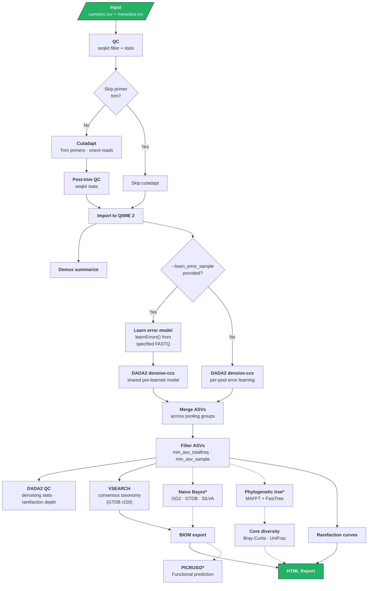

# HiFi-16S-workflow

A Nextflow DSL2 pipeline for processing PacBio HiFi full-length 16S amplicon data into high-quality ASVs using QIIME 2 and DADA2.

## Overview

This pipeline takes demultiplexed 16S amplicon FASTQ files and produces quality-filtered ASVs, taxonomy classifications, diversity metrics, and an interactive HTML report.

### Pipeline Steps

1. **Read QC** — Quality filtering with seqkit, optional downsampling
2. **Primer trimming** (optional) — Cutadapt removes V1-V9 primers and orients reads
3. **QIIME 2 import** — Reads imported as SampleData[SequencesWithQuality] artifacts
4. **DADA2 denoising** — Error learning and denoising via `denoise-ccs` with configurable error models (auto-detects Sequel II vs Revio/Kinnex)
5. **ASV filtering** — Remove low-abundance ASVs by total frequency and sample presence
6. **Taxonomy classification** — VSEARCH consensus classification (GTDB r220 default) and optional Naive Bayes multi-database classification (GreenGenes2, GTDB, SILVA)
7. **Phylogenetic diversity** (optional) — MAFFT alignment, FastTree, core diversity metrics (Bray-Curtis, UniFrac)
8. **BIOM export** — Feature tables with taxonomy metadata
9. **HTML report** — Interactive visualizations (taxonomy barplots, MDS/PCA, rarefaction curves)
10. **PICRUSt2** (optional) — Functional pathway prediction from 16S sequences

### Pipeline Diagram



\* Dashed edges = optional (`--skip_nb`, `--skip_phylotree`, `--run_picrust2`)

## Quick Start

```bash
# Download taxonomy databases (one-time setup)
nextflow run main.nf --download_db -profile singularity

# Run the pipeline
nextflow run main.nf \
    -profile singularity \
    --input samples.tsv \
    --metadata metadata.tsv \
    --outdir results
```

### Stub Test

```bash
# Create test sample TSV
echo -e "sample-id\tabsolute-filepath\ntest_data\t$(readlink -f test_data/test_1000_reads.fastq.gz)" > test_data/test_sample.tsv

# Run with test data
nextflow run main.nf \
    --input test_data/test_sample.tsv \
    --metadata test_data/test_metadata.tsv \
    -profile singularity \
    --outdir results
```

## Running the Pipeline

16S analysis is typically fast (2-12 hours) but can be longer for highly diverse environmental samples. Launch from the pipeline directory inside a terminal multiplexer:

```bash
tmux new -s hifi16s
cd /path/to/HiFi-16S-workflow
```

### Work directory

Nextflow writes intermediate files to a `work/` directory. Point it at a volume with sufficient space using `-w`:

```bash
nextflow run main.nf \
    -profile singularity \
    --input samples.tsv \
    --metadata metadata.tsv \
    -w /scratch/nf-work/hifi16s \
    --outdir results
```

The `.nextflow/` directory (run history, task cache) is always written to the **launch directory** — keep this separate from the work directory.

### Output

Final results are **copied** (not symlinked) to `--outdir` by default (`--publish_dir_mode copy`), so they remain available after the work directory is cleaned.

## Input

### Sample TSV

Tab-separated file with two columns:

```
sample-id	absolute-filepath
sample_A	/data/sample_A.fastq.gz
sample_B	/data/sample_B.fastq.gz
```

### Metadata TSV

Tab-separated file with at least `sample_name` and `condition` columns:

```
sample_name	condition
sample_A	treatment
sample_B	control
```

An optional `pool` column splits samples into separate DADA2 denoising groups (see [Pooling](#pooling) below).

## Parameters

### Core

| Parameter | Default | Description |
|-----------|---------|-------------|
| `--input` | required | Path to sample TSV |
| `--metadata` | required | Path to metadata TSV |
| `--outdir` | `results` | Output directory |
| `--publish_dir_mode` | `copy` | Nextflow publishDir mode |

### QC and Trimming

| Parameter | Default | Description |
|-----------|---------|-------------|
| `--filterQ` | `20` | Minimum read quality score |
| `--downsample` | `0` | Limit reads per sample (0 = disabled) |
| `--skip_primer_trim` | `false` | Skip cutadapt primer trimming |
| `--front_p` | `AGRGTTYGATYMTGGCTCAG` | Forward primer (F27) |
| `--adapter_p` | `AAGTCGTAACAAGGTARCY` | Reverse primer (R1492) |

### DADA2

| Parameter | Default | Description |
|-----------|---------|-------------|
| `--min_len` | `1000` | Minimum amplicon length |
| `--max_len` | `1600` | Maximum amplicon length |
| `--max_ee` | `2` | Maximum expected errors |
| `--minQ` | `0` | Minimum base quality |
| `--omegac` | `1e-40` | DADA2 OMEGA_C parameter for chimera detection |
| `--pooling_method` | `pseudo` | DADA2 pooling (`pseudo` or `independent`) |
| `--error_model` | `auto` | Error model: `auto`, `pacbio`, `binned`, `loess` |
| `--learn_error_sample` | `false` | FASTQ path for external error learning |

### ASV Filtering

| Parameter | Default | Description |
|-----------|---------|-------------|
| `--min_asv_totalfreq` | `5` | Minimum total reads across all samples per ASV (auto-set to 0 for single sample) |
| `--min_asv_sample` | `1` | Minimum samples an ASV must appear in (auto-set to 0 for single sample) |

### Taxonomy — VSEARCH (always runs)

VSEARCH consensus classification runs on every pipeline execution using the GTDB r220 database by default.

| Parameter | Default | Description |
|-----------|---------|-------------|
| `--vsearch_identity` | `0.97` | VSEARCH minimum identity threshold |
| `--maxreject` | `100` | VSEARCH max-reject parameter |
| `--maxaccept` | `100` | VSEARCH max-accept parameter |
| `--vsearch_db` | `databases/GTDB_ssu_all_r220.qza` | VSEARCH reference sequences |
| `--vsearch_tax` | `databases/GTDB_ssu_all_r220.taxonomy.qza` | VSEARCH taxonomy annotations |

### Taxonomy — Naive Bayes (optional)

When enabled (default), DADA2's `assignTaxonomy()` classifies every ASV against **all three databases independently** (minBoot = 80). All three results are saved to `nb_tax/` (`silva_nb.tsv`, `gtdb_nb.tsv`, `gg2_nb.tsv`).

A cascade then merges the three results into `best_taxonomy.tsv`:

1. Start with the **priority database** result as the baseline (default: GG2)
2. For any ASV where Species is `NA`, fill from the 2nd database (GTDB)
3. Still `NA`? Fill from the 3rd database (SILVA)
4. Repeat the same cascade for Genus-level gaps

This maximizes taxonomic coverage — if GG2 classifies 90% of ASVs to species, GTDB may fill another 7%, and SILVA the remaining 2%. Each row in the output includes an `Assignment Database` column tracking which database provided that ASV's classification.

The priority order for each `--db_to_prioritize` setting:

| Setting | Cascade order |
|---------|--------------|
| `GG2` (default) | GreenGenes2 → GTDB → SILVA |
| `GTDB` | GTDB → GreenGenes2 → SILVA |
| `Silva` | SILVA → GreenGenes2 → GTDB |

| Parameter | Default | Description |
|-----------|---------|-------------|
| `--skip_nb` | `false` | Skip Naive Bayes classification (use VSEARCH only) |
| `--db_to_prioritize` | `GG2` | Starting database for NB cascade: `GG2`, `GTDB`, or `Silva` |
| `--silva_db` | `databases/silva_nr99_v138.2_...` | SILVA training set for NB classifier |
| `--gtdb_db` | `databases/GTDB_bac120_arc53_...` | GTDB training set for NB classifier |
| `--gg2_db` | `databases/gg2_2024_09_...` | GreenGenes2 training set for NB classifier |

### Resources

| Parameter | Default | Description |
|-----------|---------|-------------|
| `--dada2_cpu` | `256` | Threads for DADA2 denoising |
| `--vsearch_cpu` | `256` | Threads for VSEARCH classification |
| `--cutadapt_cpu` | `64` | Threads for cutadapt |

### Optional

| Parameter | Default | Description |
|-----------|---------|-------------|
| `--run_picrust2` | `false` | Run PICRUSt2 pathway prediction |
| `--skip_phylotree` | `false` | Skip phylogenetic tree construction and diversity metrics |
| `--rarefaction_depth` | `null` | Manual rarefaction depth (auto-calculated if not set or 0) |
| `--colorby` | `condition` | Metadata column for coloring MDS plots |
| `--save_intermediates` | `false` | Save intermediate files (filtered/trimmed FASTQs, QIIME2 artifacts, DADA2 working files) |

## Profiles

| Profile | Description |
|---------|-------------|
| `singularity` | Run with Singularity containers (recommended) |
| `docker` | Run with Docker containers |
| `conda` | Run with conda environments (slower initial setup) |
| `standard` | Alias for `conda` |

## Databases

Databases are downloaded to `databases/` in the pipeline directory via `--download_db`:

| Database | Version | Used by |
|----------|---------|---------|
| GTDB SSU r220 | r220 | VSEARCH classification (default) |
| SILVA | v138.2 | Naive Bayes classification |
| GreenGenes2 | 2024.09 | Naive Bayes classification |
| GTDB NB | r220 | Naive Bayes classification |

Paths are configurable via `--vsearch_db`, `--vsearch_tax`, `--silva_db`, `--gtdb_db`, `--gg2_db`.

## Pooling

For highly diverse samples (e.g., environmental), DADA2 pseudo-pooling across all samples can be slow. Add a `pool` column to metadata to split denoising into groups:

```
sample_name	condition	pool
sample_A	soil	group1
sample_B	soil	group1
sample_C	water	group2
sample_D	water	group2
```

Samples are denoised separately per group, then ASVs are merged automatically. This is orthogonal to `--pooling_method`, which controls DADA2's internal pooling behavior within each group.

## Error Model Selection

The `--error_model auto` setting (default) detects the sequencing platform from quality score distributions:

| Platform | Q-score pattern | Model selected |
|----------|----------------|----------------|
| Sequel / Sequel II | Q93 present | `PacBioErrfun` |
| Revio / Kinnex / NovaSeq / ONT | <=15 unique Q values | `makeBinnedQualErrfun` |
| Older Illumina | Continuous Q-scores | `loessErrfun` |

Override with `--error_model pacbio`, `--error_model binned`, or `--error_model loess`.

## Primer Trimming

Cutadapt trims primers using **linked adapter** syntax, matching the forward primer at the 5' end and the reverse primer at the 3' end in a single pass. Reads are also reverse-complemented as needed (`--revcomp`) and only trimmed reads are kept (`--trimmed-only`).

The default primers are the universal bacterial 16S V1-V9 pair:

| Primer | Name | Sequence |
|--------|------|----------|
| Forward | F27 | `AGRGTTYGATYMTGGCTCAG` |
| Reverse | R1492 | `AAGTCGTAACAAGGTARCY` |

IUPAC degenerate bases are supported natively by cutadapt, so a single degenerate sequence covers all primer variants.

### Multiplexed primer sets (not yet supported)

The pipeline currently accepts a **single primer pair** via `--front_p` and `--adapter_p`. If you multiplex amplicons with different primer sets in the same library (e.g., bacterial F27/R1492 + archaeal A344F/A915R), the current pipeline will only trim and retain reads matching one pair.

Cutadapt itself supports multiple primer pairs via repeated `-g` flags or a linked-adapter FASTA (`-g file:primers.fasta`). Implementing this would require:

1. Accepting a primer pairs file (e.g., TSV or FASTA of linked adapters)
2. Modifying the cutadapt process to emit one `-g` per pair
3. No changes to DADA2 or downstream — trimmed reads are primer-agnostic

A `--primer_fasta` parameter exists in the config but is currently unused (legacy from the original PacBio pipeline). This could be repurposed for multi-primer support in a future release.

**Workaround**: Run the pipeline separately for each primer set using `--front_p` / `--adapter_p`, then merge the resulting BIOM tables downstream.

## Output

```
results/
├── results/
│   ├── reads_QC/                 # Aggregated QC statistics
│   ├── phylogeny_diversity/      # Tree, distance matrices, core metrics
│   ├── visualize_biom.html       # Interactive HTML report
│   ├── taxonomy_barplot_*.qzv    # QIIME 2 barplot visualizations
│   ├── *_merged_freq_tax.tsv     # Frequency + taxonomy tables
│   ├── feature-table-tax*.biom   # BIOM files
│   ├── dada2_ASV.fasta           # Filtered ASV sequences
│   ├── dada2_qc.tsv              # Denoising statistics
│   └── alpha-rarefaction-curves.qzv
├── nb_tax/                       # Per-database Naive Bayes results (unless --skip_nb)
├── parameters.txt                # Pipeline parameters log
├── execution_report.html         # Nextflow execution report
└── execution_timeline.html       # Nextflow timeline

# With --save_intermediates:
├── filtered_input_FASTQ/         # Quality-filtered FASTQs
├── trimmed_primers_FASTQ/        # Primer-trimmed FASTQs
├── cutadapt_summary/             # Cutadapt reports
├── import_qiime/                 # QIIME 2 artifacts (.qza)
├── summary_demux/                # Per-sample read counts
└── dada2/                        # ASV sequences, tables, error plots
```

## Tools

| Tool | Purpose |
|------|---------|
| seqkit | Read quality filtering and statistics |
| cutadapt | Primer trimming and read orientation |
| QIIME 2 | Framework for import, demux, diversity, visualization |
| DADA2 | ASV denoising and error correction |
| VSEARCH | Consensus taxonomy classification |
| MAFFT | Multiple sequence alignment |
| FastTree | Phylogenetic tree construction |
| PICRUSt2 | Functional pathway prediction (optional) |

## Requirements

- Nextflow >= 22.0
- Singularity, Docker, or conda
- At least 32 CPUs recommended (64+ GB memory for diverse samples)

## Citation and Acknowledgements

This repository is a modified, actively maintained fork of the original [HiFi-16S-workflow](https://github.com/PacificBiosciences/HiFi-16S-workflow) created by [Chua Khi Pin](https://github.com/proteinosome) at Pacific Biosciences.

If you use this modified Nextflow pipeline in your research, please cite this repository to ensure accurate reproducibility:

**APA Format:**
> Bartelme, R., & Sobel-Sorenson, C. (2026). *HiFi-16S-workflow (AGI fork)* [Software]. GitHub. https://github.com/UA-CALES-SPLS-AGI/HiFi-16S-workflow

### Suggested Methods Text
The following may be used in your bioinformatics or data processing Methods section of your manuscript:

> Full-length 16S rRNA sequences were processed into amplicon sequence variants (ASVs) using the HiFi-16S-workflow pipeline originally developed at Pacific Biosciences.  To ensure reproducibility and best practices, we utilized an actively maintained fork of the pipeline modified by the Arizona Genomics Institute.  The exact source code and execution environments used in this study are publicly available at https://github.com/UA-CALES-SPLS-AGI/HiFi-16S-workflow.
